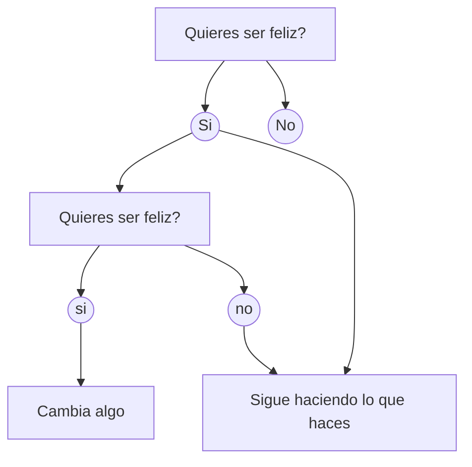
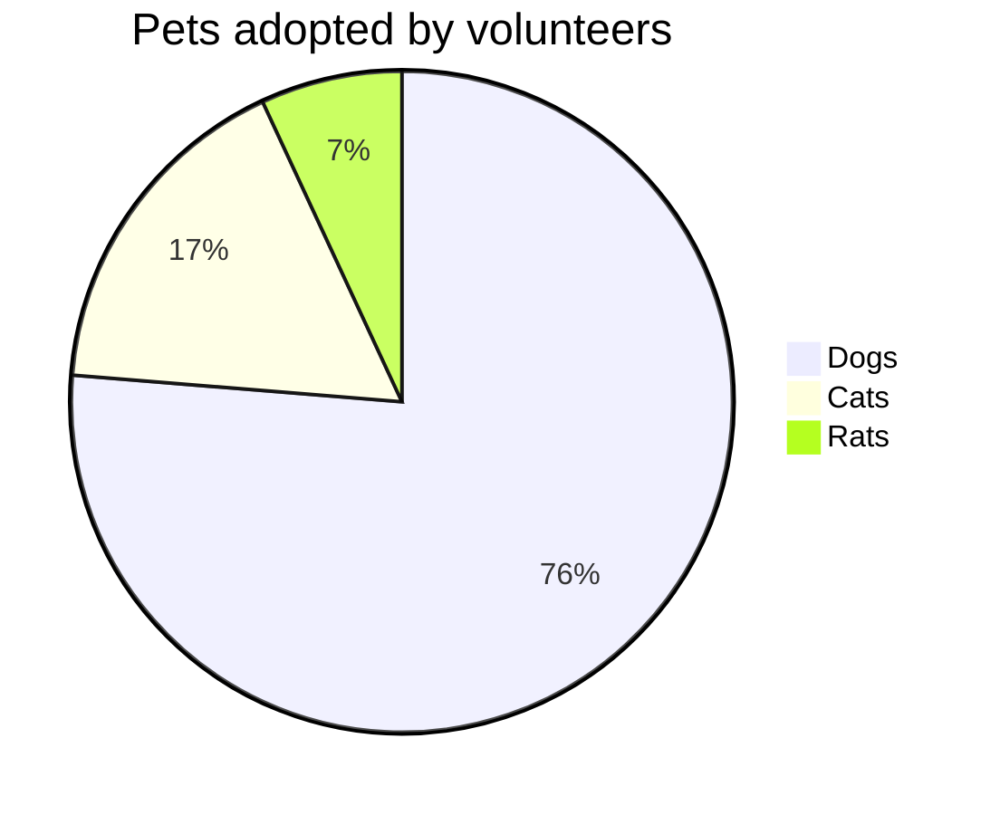

```
​```sequence
Alice->Bob: Hola bob, como estas?
Note right of Bob: bob piensa
Bob-->Alice: Todo bien gracias
```


```sequence
Alice->Bob: Hola bob, como estas?
Note right of Bob: bob piensa
Bob-->Alice: Todo bien gracias
```


```
​```flow
st=>start: Preguntate
inicio=>condition: Eres ser feliz?
preguntate=>condition: ¿Quieres ser feliz?
cambiar=>operation: Cambia algo
fin=>end: sigue haciendo lo que sea que haces

st->inicio
inicio(yes)->fin
inicio(no)->preguntate
preguntate(yes)->cambiar
preguntate(no)->fin
```


```flow
st=>start: Preguntate
inicio=>condition: Eres ser feliz?
preguntate=>condition: ¿Quieres ser feliz?
cambiar=>operation: Cambia algo
fin=>end: sigue haciendo lo que sea que haces

st->inicio
inicio(yes)->fin
inicio(no)->preguntate
preguntate(yes)->cambiar
preguntate(no)->fin
```

```
​```flow
st=>start: Start
op=>operation: Your Operation
cond=>condition: Yes or No?
e=>end

st->op->cond
cond(yes)->e
cond(no)->op
```


```flow
st=>start: Start
op=>operation: Your Operation
cond=>condition: Yes or No?
e=>end

st->op->cond
cond(yes)->e
cond(no)->op
```


```
​```flow
st=>condition: inicio
fin1=>end: pues nada
fin2=>end: genial

st(yes)->fin1
st(no)->fin2
```


```flow
st=>condition: inicio
fin1=>end: pues nada
fin2=>end: genial

st(yes)->fin1
st(no)->fin2
```


```
​```mermaid
graph TD
A["Quieres ser feliz?"]
	A -->A1(("Si"))
	A -->A2(("No"))
A1 -->B["Quieres ser feliz?"]
	B -->B1(("si"))
	B -->B2(("no"))
B2 -->C["Sigue haciendo lo que haces"]
A1 -->C
B1 -->D["Cambia algo"]
```







